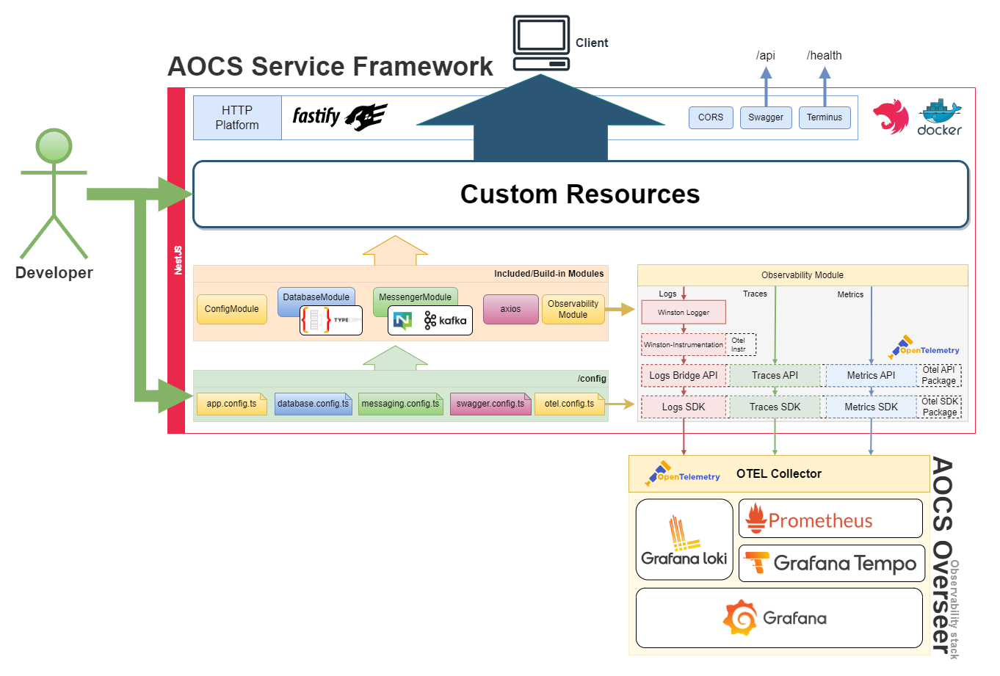

# Introduction

This template serve as a starter kit for developing a microservice in AOCS term. It aims to provide a standardised base for microservices development.

At it's core, the template is based on the mature Nest framework, please consume the following guide with the [official Nest documentation](https://docs.nestjs.com/).

This template will provide value to developer in 2 ways, namely `structure` and `function modules`.

- `structure`: configs are extracted into a centralised place.
- `modules`: to provide `ORM`, `observability` and `Messaging` support for example.

This framework is designed with simplicity and flexibility in mind. Module or structures can be removed if deem unnecessary.

I will assume you have experience with `Typescript` and `WebApp Development`. 

If not, [here](https://docs.nestjs.com/first-steps) should be a good start.

## Inside the template

This template comes with several modules registered and ready to consume within your services.

Includes:
- [config](https://docs.nestjs.com/techniques/configuration#configuration): config management module.
- [Fastify](https://docs.nestjs.com/techniques/performance): web server platform of choice. (replaces default express.js)
- [cors (disabled)](https://docs.nestjs.com/security/cors#getting-started): cors module. 
- [swagger](https://docs.nestjs.com/openapi/introduction): openapi module.
- [terminus](https://docs.nestjs.com/recipes/terminus): readiness/liveness health checks module.
- [TypeORM (+migration, better-sqlite)](https://docs.nestjs.com/recipes/sql-typeorm)
- [swc](https://docs.nestjs.com/recipes/swc): Speedy Web Compiler. (replaces default Typescript compiler)
- axios
- containerized
- [Observability](https://github.com/pragmaticivan/nestjs-otel?tab=readme-ov-file)
- [Winston](https://github.com/gremo/nest-winston) logger
- [NATS](https://github.com/nats-io/nats.js)
- [Kafka](https://kafka.js.org/)

some of the modules should be familiar to a Web developer.

## Developer Guides
- [Config Management](./config.md)
- [HTTP Server](./server.md)
- [TypeORM](./typeorm.md)
- [Observability](./observability.md)
- [Logging](./logger.md)
- [Messenger](./messenger.md)

## Examples

Checkout the following branches to view the corresponding examples:

- example/Todo: a simple service with CRUD through TypeORM database.
- example/workflow-engine: a simple client for activating/deactivating workflows with Workflow Engine.
- example/snakes-and-ladders: for demonstrating observability, works with  `AOCS Overseer/snakes-and-ladders`.
- example/messenger: demonstrating the custom messenger interface for interaction with NATS/Kafka module.