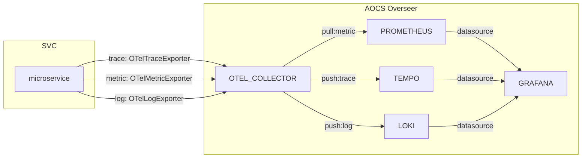

# Observability

This template includes OpenTelemetry Node SDK + `nestjs-otel`(metric, trace) + `winston`(logs) to achieve `Observability`.

Together with `AOCS Overseer`, stakeholders can observe `metrics`, `trace` and `logs` through Grafana dashboard.



## OpenTelemetry Options

OpenTelemetry SDK can be managed through environment variables.

```
OTEL_EXPORTER_OTLP_ENDPOINT=http://localhost:4318
OTEL_SDK_DISABLED=false
OTEL_LOG_LEVEL=info
OTEL_TRACES_EXPORTER=otlp # none, console, jaeger and zipkin
OTEL_METRICS_EXPORTER=oltp # none, console and prometheus
OTEL_LOGS_EXPORTER=oltp # none and console
```

| `none` for exporters will disable the exportation.

Refer to the official [documentation](https://opentelemetry.io/docs/specs/otel/configuration/sdk-environment-variables/) for detail options.

## Telemetry Setup

OpenTelemetry SDK is defined in `telemetry.ts` and options are defined in `otel.config.ts`.

| `otel.config.ts` options overrides OpenTelemetry environment variables

```ts
// Refer to @opentelemetry/exporter-metrics-otlp-http docs
const MetricExporterConfig = {};

// Refer to @opentelemetry/exporter-trace-otlp-http docs
const TraceExporterConfig = {};

// Refer to @opentelemetry/exporter-logs-otlp-http docs
const LogExporterConfig = {};
```

Refer to the [nestjs-otel](https://github.com/pragmaticivan/nestjs-otel#readme) documentation for more details. 
